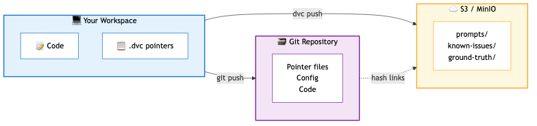
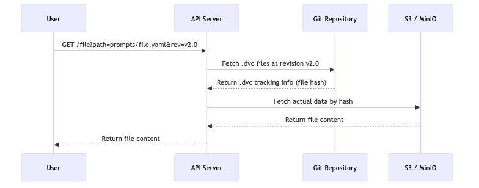

# 🗂️ SAST-AI Data Repository

> **Version-controlled data storage for the SAST-AI project** — keeping prompts, known issues, and test data organized, versioned, and accessible.

---

## 📖 What is This Repository?

This repository serves as the **central data hub** for the [SAST-AI-Workflow](https://github.com/RHEcosystemAppEng/sast-ai-workflow) project (Static Application Security Testing with AI).

### Data We Manage

| Dataset | Purpose |
|---------|---------|
| **Prompts** | AI prompt templates used by the SAST-AI-Workflow project |
| **Known Non-Issues** | Curated lists of false positives per package — prevents the AI from flagging known safe patterns |
| **Ground Truth Sheets** | Validated security findings used for training and evaluation |
| **Testing Data (NVRs)** | Package Name-Version-Release data for testing |

---

## 🤔 Why DVC? The Problem We're Solving

### The Challenge

When building AI systems, you often deal with:
- **Large files** that slow down Git repositories
- **Frequently changing data** that needs version history
- **Data & code synchronization** — ensuring the right model uses the right prompts/data

Git is amazing for code, but it wasn't designed for large binary files or datasets. Storing large files in Git leads to:
- 🐌 Slow clone/pull operations
- 💾 Bloated repository size
- 🔄 No efficient diffing for binary files

### The Solution: DVC (Data Version Control)

**DVC** extends Git to handle data files. Think of it as "Git for Data."



<table>
<tr>
<td width="50%">

**🗃️ Git stores (lightweight)**
- `.dvc` pointer files (~100 bytes each)
- Configuration & code
- Full version history

</td>
<td width="50%">

**☁️ S3/MinIO stores (scalable)**
- Actual data files (any size)
- Deduplicated storage
- Fast parallel downloads

</td>
</tr>
</table>

**Key Benefits:**
- ✅ **Version Control for Data** — Track changes, rollback, compare versions
- ✅ **Lightweight Git Repo** — Only small `.dvc` pointer files in Git
- ✅ **Remote Storage** — Actual data lives in S3/MinIO (scalable, cheap)
- ✅ **Reproducibility** — Lock exact data versions with Git tags

---

## 🔄 How It All Connects



### Where Things Live

| Location | What's Stored | Example |
|----------|---------------|---------|
| **Git** | DVC config + tracking files (lightweight) | `.dvc/config`, `prompts.dvc` |
| **S3/MinIO** | Actual data files (any size) | prompt YAML files, ignore lists |

---

## 🚀 Getting Started

### Option 1: Using the DVC CLI (For Data Engineers & Contributors)

Best for: Downloading data locally, adding new data, updating existing files.

```bash
# Clone the repository
git clone <repo-url>
cd sast-ai-dvc

# Pull all tracked data files
dvc pull

# Get a specific file
dvc get . known-non-issues-el10/adcli/ignore.err -o ./ignore.err

# Get a file at a specific version
dvc get . prompts/sast-ai-prompts.yaml --rev v2.0.0 -o ./prompts.yaml
```

### Option 2: Using the API Server (For Applications & Services)

Best for: Other services that need to fetch data programmatically without installing DVC.

```bash
# Get known non-issues for a package
curl http://localhost:8000/known-non-issues-el10/adcli

# Get prompts file
curl http://localhost:8000/prompts/sast-ai-prompts.yaml

# Get file at specific version
curl "http://localhost:8000/file?path=prompts/sast-ai-prompts.yaml&rev=v2.0"

# Check if a file exists
curl "http://localhost:8000/exists?path=prompts/sast-ai-prompts.yaml"

# Health check
curl http://localhost:8000/health
```

---

## 🖥️ Running the API Server

### Local Development

```bash
cd app
pip install -r requirements.txt

# Set required environment variables
export GIT_REPO_URL=https://github.com/your-org/dvc-repo.git
export AWS_ACCESS_KEY_ID=your-key
export AWS_SECRET_ACCESS_KEY=your-secret

# Start the server
python main.py
```

### Deploy to OpenShift

```bash
cd app/deploy

# Edit secret.yaml with your credentials
oc apply -f secret.yaml
oc apply -f deployment.yaml
```

See [app/deploy/README.md](app/deploy/README.md) for detailed deployment instructions.

---

## 📁 Repository Structure

```
sast-ai-dvc/
├── .dvc/
│   └── config                 # S3/MinIO connection settings
│
├── known-non-issues-el10.dvc  # Tracks: package-specific false positive lists
├── prompts.dvc                # Tracks: AI prompt templates
├── ground_truth_sheets.dvc    # Tracks: validated security findings
├── testing-data-nvrs.yaml.dvc # Tracks: test package data
│
└── app/                       # API server
    ├── main.py                # FastAPI application
    ├── requirements.txt       # Python dependencies
    ├── Dockerfile             # Container build
    └── deploy/                # OpenShift manifests
```

---

## ⚙️ Configuration

### Environment Variables

| Variable | Required | Description |
|----------|----------|-------------|
| `GIT_REPO_URL` | ✅ | Git repository URL (remote or local path) |
| `AWS_ACCESS_KEY_ID` | ✅ | S3/MinIO access key |
| `AWS_SECRET_ACCESS_KEY` | ✅ | S3/MinIO secret key |
| `LOG_LEVEL` | ❌ | Logging level (default: `INFO`) |

---

## 📚 Common Workflows

### Adding New Data

```bash
# Add a new file to DVC tracking
dvc add my-new-dataset/

# Commit the .dvc file to Git
git add my-new-dataset.dvc .gitignore
git commit -m "Add new dataset"

# Push data to remote storage
dvc push

# Push Git changes
git push
```

### Updating Existing Data

```bash
# Make your changes to the data files
# ...

# DVC detects changes automatically
dvc add known-non-issues-el10/

# Commit and push
git add known-non-issues-el10.dvc
git commit -m "Update known non-issues"
dvc push
git push
```

### Accessing Historical Versions

```bash
# Via CLI
dvc get . prompts/sast-ai-prompts.yaml --rev v1.0.0 -o ./old-prompts.yaml

# Via API
curl "http://localhost:8000/file?path=prompts/sast-ai-prompts.yaml&rev=v1.0.0"
```

---

## 🔗 Related Resources

- [DVC Documentation](https://dvc.org/doc) — Official DVC guides
- [DVC Get Started Tutorial](https://dvc.org/doc/start) — Learn DVC basics

---

## 📝 License

See [LICENSE](LICENSE) for details.
