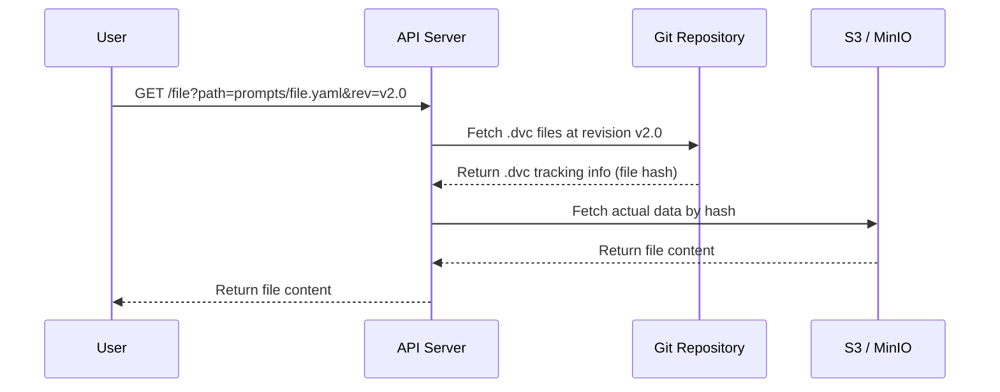

# DVC Data Repository

Version-controlled data storage using DVC with S3/MinIO backend.

## How It Works



**What's stored where:**

| Location | What | Example |
|----------|------|---------|
| **Git** | DVC config + tracking files | `.dvc/config`, `prompts.dvc` |
| **S3/MinIO** | Actual data files | prompts, known-non-issues, etc. |

## Using DVC CLI

```bash
# Pull all data
dvc pull

# Get specific file
dvc get . known-non-issues-el10/adcli/ignore.err -o ./ignore.err

# Get at specific revision
dvc get . prompts/sast-ai-prompts.yaml --rev v2.0.0 -o ./prompts.yaml
```

## Using API Server

### Run Locally
```bash
cd app
pip install -r requirements.txt

export GIT_REPO_URL=https://github.com/your-org/dvc-repo.git
export AWS_ACCESS_KEY_ID=your-key
export AWS_SECRET_ACCESS_KEY=your-secret

python main.py
```

### Endpoints
```bash
# Get file
curl http://localhost:8000/known-non-issues-el10/adcli
curl "http://localhost:8000/file?path=prompts/sast-ai-prompts.yaml&rev=v2.0"

# Check exists
curl "http://localhost:8000/exists?path=prompts/sast-ai-prompts.yaml"

# Health
curl http://localhost:8000/health
```

### Deploy to OpenShift
```bash
cd app/deploy
# Edit secret.yaml with: GIT_REPO_URL, AWS credentials
oc apply -f secret.yaml
oc apply -f deployment.yaml
```

## Repository Structure

```
├── .dvc/config                # S3/MinIO connection config
├── known-non-issues-el10.dvc  # Tracks known-non-issues data
├── prompts.dvc                # Tracks prompts data
├── ground_truth_sheets.dvc    # Tracks ground truth data
└── app/                       # API server code
```

## Configuration

| Variable | Description |
|----------|-------------|
| `GIT_REPO_URL` | Git repository URL (required) |
| `AWS_ACCESS_KEY_ID` | S3 access key (required) |
| `AWS_SECRET_ACCESS_KEY` | S3 secret key (required) |

